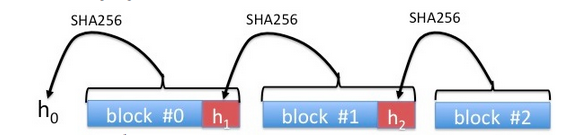

Suppose a web site hosts large video file $F$ that anyone can download. Browsers who download the file need to make sure the file is authentic before displaying the content to the user.  One approach is to have the web site hash the contents of $F$ using a collision resistant hash and then distribute the resulting short hash value $h = H(F)$ to users via some authenticated channel (later on we will use digital signatures for this). Browsers would download the entire file $F$, check that $H(F)$ is equal to the authentic hash value $h$ and if so, display the video to the user. Unfortunately, this means that the video will only begin playing after the *entire* file $F$ has been downloaded.

Our goal in this project is to build a file authentication system that lets browsers authenticate and play video chunks as they are downloaded without having to wait for the entire file. Instead of computing a hash of the entire file, the web site breaks the file into 1KB blocks (1024 bytes).  It computes the hash of the last block and appends the value to the second to last block.  It then computes the hash of this augmented second to last block and appends the resulting hash to the third block from the end.   This process continues from the last block to the first as in the following diagram:

The final hash value $h_0$ - a hash of the first block with its appended hash – is distributed to users via the authenticated channel as above.

Now, a browser downloads the file $F$ one block at a time, where each block includes the appended hash value from the diagram above. When the first block $(B_0 \,\|\, h_1)$ is received the browser checks that $H(B_0 \,\|\, h_1)$ is equal to $h_0$ and if so it begins playing the first video block. When the second block $(B_1 \,\|\, h_2)$ is received the browser checks that $H(B_1 \,\|\, h_2)$ is equal to $h_1$ and if so it plays this second block. This process continues until the very last block. This way each block is authenticated and played as it is received and there is no need to wait until the entire file is downloaded.

It is not difficult to argue that if the hash function $H$ is collision resistant then an attacker cannot modify any of the video blocks without being detected by the browser.  Indeed, since $h_0 = (B_0 \,\|\, h_1)$ an attacker cannot find a pair $(B_0', h_1') \neq (B_0, h_1)$ such that $h_0 = H(B_0' \,\|\, h_1')$ since this would break collision resistance of $H$. Therefore after the first hash check the browser is convinced that both $B_0$ and $h_1$ are authentic. Exactly the same argument proves that after the second hash check the browser is convinced that both $B_1$ and $h_2$ are authentic,  and so on for the remaining blocks.

When appending the hash value to each block, please append it as binary data, that is, as 32 unencoded bytes (which is 256 bits).  If the file size is not a multiple of 1KB then the very last block will be shorter than 1KB, but all other blocks will be exactly 1KB.

Your task is to write code to compute the hash $h_0$ of a given file $F$ and to verify blocks of $F$ as they are received by the client. 

A given hex encoded $h_0$ for a test file is `03c08f4ee0b576fe319338139c045c89c3e8e9409633bea29442e21425006ea8`